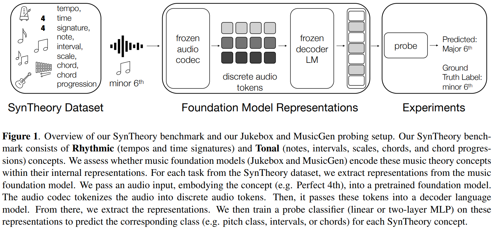
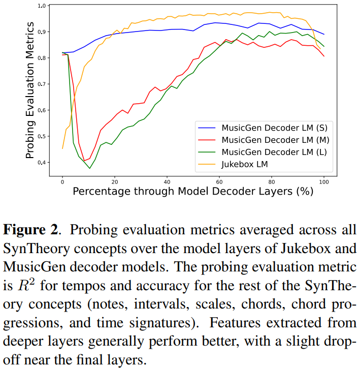

>:sailboat: &ensp; [*0101* **&#x21e6;**](0101.md) &ensp; 2025/**0102** &ensp;

## 《Mathematical Foundations of Reinforcement Learning》

### Chapter 2

* State value: the expected value of return.

* Bellman equation:

  * A simplified version:
    $$
    v = r + \gamma P v
    $$

    While $v$ is the state value, $r$ is the reward, $\gamma$ is the discount factor, $P$ is the policy & transition matrix.

    Then the state value can be resolved as:
    $$
    v = (I - \gamma P)^{-1} r
    $$

  * Formal version:
    $$
    \begin{align}
    v_{\pi}(s) &= \mathbb{E} [R_{t+1} | S_t = s] + \gamma \mathbb{E} [G_{t+1} | S_t = s] \\
    &= \sum _ {a \in \mathcal{A}} \pi(a|s) \left[ \sum _ {r \in \mathcal {R}} p(r | s, a)r + \gamma \sum _ {s' \in \mathcal{S}} p(s'| s, a) v_{\pi}(s') \right] \\
    &= \sum _ {a \in \mathcal{A}} \pi(a|s) \sum _ {s' \in \mathcal{S}} \sum _ {r \in \mathcal{R}} p(s', r | s, a) [r + \gamma v_{\pi}(s')]
    \end{align}
    $$

    * The first item is the immediate reward, the second item is the discounted value of the next state.

* State value $v_{\pi}(s)$ depends on $\pi$ and $s$, not depends on $t$.

## DO MUSIC GENERATION MODELS ENCODE MUSIC THEORY?

By: *Megan Wei* @*Brown University*

Paper: [DO MUSIC GENERATION MODELS ENCODE MUSIC THEORY?](https://arxiv.org/pdf/2410.00872)

* **SynTheory**: a synthetic MIDI and audio music theory dataset, consisting of tempos, time signatures, notes, intervals, scales, chords, and chord progressions concepts.
  * https://huggingface.co/datasets/meganwei/syntheory

